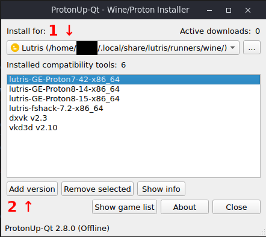
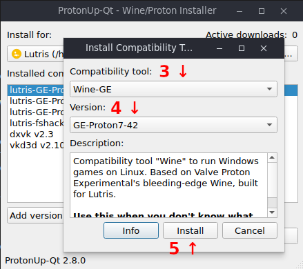
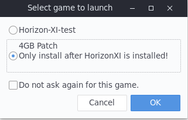

# Horizons-XI Lutris installer

### Horizons-XI.yaml
Basic install script that download and autoconifgs most of the headaches
of linux installation.

#### Requirements
ProtonUp-Qt and runner "lutris-GE-Proton7-42-x86_64" installed for lutris.

Install ProtonUp-Qt on your distribution and open it up. 
1. At the top make sure Lutris is selected. 
2. Then hit "Add Version"



3. Select "Wine-GE" for compatability tool.
4. Select "GE Proton 7-42" for version.
5. Hit install and once it's complete you're done with ProtonUp-Qt.




#### Features
- HorizonXI Launcher v1.2.1
- 4gb Patch Provided as an alternate launch option

#### Installation
1. Download the Horizon-XI.yaml from the repo.
2. Open Lutris hit the (+)plus in the top left.
3. Select install from YAML file
4. Navigate to the .yaml file you downloaded
5. Follow the steps of the installer.
6. Once it's complete hit **close**
7. If you wish to install the 4gb patch just select that option when you launch the game and navigate to:
  
    

    ```~/Games/horizon-xi/drive_c/HorizonXI/Game/bootloader/horizon-laoder.exe```

8. Hit patch, once complete you can safely close and relaunch the game.

Note: You might get an error about missing the prereqs.zip, you
      can ignore this.

### Skipping the Launcher
This will be added as an additional launch option in the future.

### Horizon-XI_Windower.yaml
Converts the HorizonXI setup to Windower.

#### TODO
- Convert this to a launch option instead of requiring a new install script to be run.

#### Requirements
- You need to have Horizon-XI.yaml installed.
- The HorizonXI Launcher must complete the installation process
  or you will be missing files.
Note: ***The above requirements are critical, if you @me in the discord 
       this is going to be the first thing I'll ask :)***
       
#### Installation
1. Download the Horizon-XI_Windower.yaml from the repo
2. Open Lutris hit the (+)plus in the top left.
3. Select install from YAML file
4. Navigate to the .yaml file you downloaded
5. Follow the steps of the installer. ***READ EVERY PROMPT***
6. Windower will launch, just let it download everything. Once you see the
   Default Profile you can close it and the installer will continue.
7. At some point a notepad should popup.
  - You will need to replace the following with your login details.
    - UserNameHere - replace with your username
    - PasswordHere - replace with your password
    Completed entry should look like this: 
    ``` 
       <args>--server play.horizonxi.com --user UserNameHere --password PasswordHere</args>
       <args>--server play.horizonxi.com --user ffxibadass --password reallygoodpassword</args>
   Note: This file is stored locally on your PC, I can't get access to it. If you're
   not comfortable please don't use this script.

8. Save and close the notepad.
9. Once the DATs are copied over from the HorizonXI Launcher folder
   another notepad will open. This is your init.txt file I've pre
   configured it to load the DATs, and set the FPS. If you know what
   you're doing make any edits you like otherwise just review and 
   close notepad.

That's it your done. You can launch windower and play the game.

Note: Windower has an issue with keyboard input. There's an addon under the addons section
      on windower called linuxfix. It will solve this issue but just take note that it is 
      currently ***not on the approved addon list***. I've already asked for approval so it 
      shouldn't take to long but be smart in the meantime.
